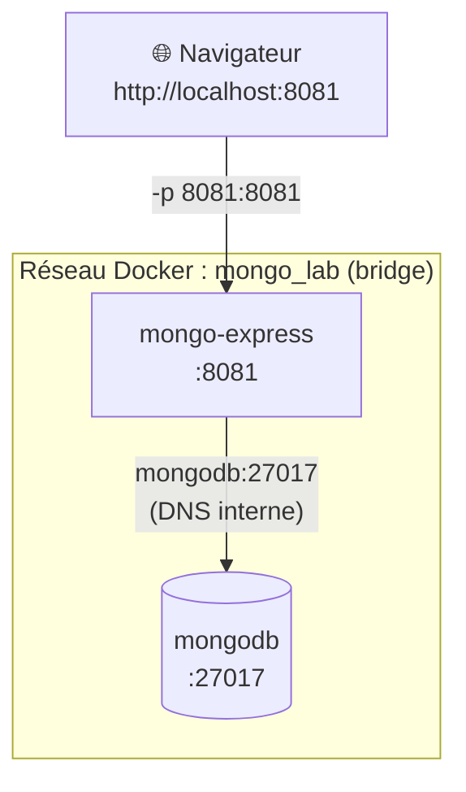

# 🐳 Docker Networking Lab — MongoDB & Mongo Express


Lab pratique de **réseaux Docker** : déploiement de deux conteneurs (MongoDB et Mongo Express) communiquant via un **réseau bridge personnalisé** et la **résolution DNS interne** de Docker.

---

## 📑 Table des matières

1. [Objectifs pédagogiques](#-objectifs-pédagogiques)
2. [Prérequis](#-prérequis)
3. [Architecture](#-architecture)
4. [Déroulement du lab](#-déroulement-du-lab)
5. [Exercices](#-exercices)
6. [Troubleshooting](#-troubleshooting)
7. [Challenge final](#-challenge-final)
8. [Nettoyage](#-nettoyage)
9. [Bonnes pratiques et sécurité](#-bonnes-pratiques-et-sécurité)
10. [Récapitulatif des commandes](#-récapitulatif-des-commandes)
11. [Corrigé des questions](#-corrigé-des-questions)

---

## 🎯 Objectifs pédagogiques

À l'issue de ce lab, vous serez capable de :

- Créer et inspecter un **réseau Docker personnalisé**
- Démarrer des conteneurs avec `docker run` et des **variables d'environnement**
- **Publier un port** du conteneur vers la machine hôte
- Faire communiquer des conteneurs **par leur nom** (DNS interne)
- Consulter les **logs** et l'état des conteneurs
- Interagir avec MongoDB via `docker exec` et `mongosh`
- **Diagnostiquer** les problèmes de connexion entre conteneurs
- **Nettoyer** proprement un environnement Docker

---

## ✅ Prérequis

| Élément | Détail |
|---|---|
| Système | Linux ou WSL2 |
| Docker | Docker Engine installé et démarré |
| Réseau | Connexion Internet (téléchargement des images) |
| Navigateur | Un navigateur Web récent |
| Connaissances | Bases des commandes Docker |

Vérification de l'installation :

```bash
docker --version
docker info
```

> Si les deux commandes s'exécutent sans erreur, vous pouvez commencer.

---

## 🏗️ Architecture



Version texte :

```text
                    Navigateur
                        |
                        |  http://localhost:8081
                        v
              +--------------------+
              |   Mongo Express    |
              |       :8081        |
              +--------------------+
                        |
                        |  nom DNS : mongodb
                        |
                 réseau : mongo_lab
                        |
                        v
              +--------------------+
              |      MongoDB       |
              |      :27017        |
              +--------------------+
```

**Points clés :**

- Les deux conteneurs partagent le réseau `mongo_lab`.
- Mongo Express joint MongoDB via le **nom du conteneur** `mongodb`, jamais via une adresse IP.
- Seul Mongo Express est **publié** sur l'hôte (port 8081). MongoDB reste **isolé** dans le réseau Docker.

---

## 🚀 Déroulement du lab

### Étape 1 — Créer le réseau Docker

```bash
docker network create mongo_lab
docker network ls
docker network inspect mongo_lab
```

> **Pourquoi un réseau personnalisé ?**
> Sur un réseau défini par l'utilisateur, Docker fournit un **DNS interne** qui permet aux conteneurs de se résoudre mutuellement par leur nom. Ce n'est pas le cas sur le réseau `bridge` par défaut.

### Étape 2 — Démarrer MongoDB

```bash
docker run -d \
  --name mongodb \
  --network mongo_lab \
  -e MONGO_INITDB_ROOT_USERNAME=admin \
  -e MONGO_INITDB_ROOT_PASSWORD=admin \
  mongo
```

| Option | Rôle |
|---|---|
| `-d` | Exécution en arrière-plan (detached) |
| `--name mongodb` | Nom du conteneur (**utilisé comme nom DNS**) |
| `--network mongo_lab` | Rattache le conteneur au réseau |
| `-e MONGO_INITDB_ROOT_USERNAME` | Utilisateur administrateur |
| `-e MONGO_INITDB_ROOT_PASSWORD` | Mot de passe administrateur |

### Étape 3 — Vérifier MongoDB

```bash
docker ps
docker logs mongodb
docker logs -f mongodb     # suivi en temps réel (CTRL+C pour quitter)
```

Résultat attendu : un conteneur `mongodb` à l'état `Up`, et dans les logs un message indiquant que MongoDB attend des connexions (`Waiting for connections`).

### Étape 4 — Démarrer Mongo Express

```bash
docker run -d \
  -p 8081:8081 \
  --name mongo-express \
  --network mongo_lab \
  -e ME_CONFIG_BASICAUTH_USERNAME=test \
  -e ME_CONFIG_BASICAUTH_PASSWORD=test \
  -e ME_CONFIG_MONGODB_SERVER=mongodb \
  -e ME_CONFIG_MONGODB_ADMINUSERNAME=admin \
  -e ME_CONFIG_MONGODB_ADMINPASSWORD=admin \
  mongo-express
```

| Option | Rôle |
|---|---|
| `-p 8081:8081` | Mapping `PORT_HÔTE:PORT_CONTENEUR` |
| `ME_CONFIG_BASICAUTH_*` | Identifiants d'accès à l'interface Web |
| `ME_CONFIG_MONGODB_SERVER=mongodb` | **Nom DNS** du serveur MongoDB (et non une IP `172.x.x.x`) |
| `ME_CONFIG_MONGODB_ADMINUSERNAME` / `ADMINPASSWORD` | Identifiants administrateur MongoDB |

> ⚠️ Démarrez Mongo Express **après** MongoDB, une fois celui-ci prêt. Si Mongo Express s'arrête faute de pouvoir joindre la base, relancez-le avec `docker start mongo-express`.

### Étape 5 — Vérifier les conteneurs

```bash
docker ps --format "table {{.Names}}\t{{.Status}}\t{{.Ports}}"
```

Résultat attendu :

```text
NAMES           STATUS          PORTS
mongodb         Up ...          27017/tcp
mongo-express   Up ...          0.0.0.0:8081->8081/tcp
```

### Étape 6 — Vérifier les logs de Mongo Express

```bash
docker logs mongo-express
```

Recherchez un message similaire à :

```text
Mongo Express server listening at http://0.0.0.0:8081
```

### Étape 7 — Accéder à l'interface Web

Ouvrez : **http://localhost:8081**

| Champ | Valeur |
|---|---|
| Username | `test` |
| Password | `test` |

> 🔒 Ces identifiants sont **réservés au lab**. Ne les utilisez jamais en production.

### Étape 8 — Se connecter à MongoDB avec `docker exec`

```bash
docker exec -it mongodb mongosh \
  -u admin \
  -p admin \
  --authenticationDatabase admin
```

Dans le shell `mongosh` :

```javascript
show dbs

use studentdb

db.students.insertOne({
  name: "Student 1",
  course: "Docker",
  status: "active"
})

db.students.find()

exit
```

Rafraîchissez Mongo Express : la base `studentdb` doit apparaître.

### Étape 9 — Inspecter le réseau

```bash
docker network inspect mongo_lab
```

Dans la section `Containers`, les deux conteneurs `mongodb` et `mongo-express` doivent apparaître : ils partagent bien le même réseau.

### Étape 10 — Inspecter les conteneurs

```bash
docker inspect mongodb
docker inspect mongo-express
```

Pour extraire uniquement les adresses IP :

```bash
docker inspect -f '{{range .NetworkSettings.Networks}}{{.IPAddress}}{{end}}' mongodb
docker inspect -f '{{range .NetworkSettings.Networks}}{{.IPAddress}}{{end}}' mongo-express
```

---

## 🧪 Exercices

### Exercice 1 — Arrêter MongoDB

```bash
docker stop mongodb
docker ps
```

**Questions :**

1. Que s'est-il passé ?
2. Mongo Express est-il toujours démarré ?
3. L'interface Mongo Express est-elle toujours accessible ?
4. Mongo Express peut-il encore accéder à MongoDB ?

Redémarrage :

```bash
docker start mongodb
docker ps
docker logs mongodb
```

### Exercice 2 — Analyser le réseau

```bash
docker network inspect mongo_lab
```

Identifiez :

- les conteneurs connectés
- l'adresse IP de MongoDB
- l'adresse IP de Mongo Express
- le **subnet**
- la **gateway**

### Exercice 3 — Déconnecter MongoDB du réseau

```bash
docker network disconnect mongo_lab mongodb
docker network inspect mongo_lab
```

**Questions :**

1. MongoDB apparaît-il encore dans le réseau ?
2. Que se passe-t-il côté Mongo Express ?
3. Pourquoi Mongo Express ne peut-il plus joindre MongoDB ?

Reconnexion :

```bash
docker network connect mongo_lab mongodb
docker network inspect mongo_lab
```

### Exercice 4 — Changer le port publié

Le port `8081` de l'hôte est déjà utilisé ? Utilisez le mapping `8082:8081` :

```bash
docker run -d \
  -p 8082:8081 \
  --name mongo-express \
  --network mongo_lab \
  ... \
  mongo-express
```

Accès : **http://localhost:8082**

> Rappel : `-p PORT_HÔTE:PORT_CONTENEUR`. Seul le port de gauche change, le port du conteneur reste `8081`.

---

## 🛠️ Troubleshooting

| Symptôme | Diagnostic | Commandes utiles |
|---|---|---|
| Mongo Express ne démarre pas | Erreur de configuration ou MongoDB injoignable | `docker ps -a` · `docker logs mongo-express` |
| MongoDB ne démarre pas | Variable manquante, conflit de nom ou de port | `docker ps -a` · `docker logs mongodb` |
| Mongo Express ne contacte pas MongoDB | Conteneurs sur des réseaux différents, mauvais nom DNS, identifiants incorrects | `docker network inspect mongo_lab` · `docker logs mongo-express` |
| Interface inaccessible | Port non publié ou déjà utilisé sur l'hôte | `docker ps` (vérifier `0.0.0.0:8081->8081/tcp`) |
| `name is already in use` | Un conteneur du même nom existe déjà | `docker rm -f <nom>` |
| `port is already allocated` | Port hôte occupé | Utiliser `-p 8082:8081` |

Commande de test DNS depuis un conteneur du réseau :

```bash
docker run --rm --network mongo_lab alpine ping -c 2 mongodb
```

> 💡 **Linux est sensible à la casse.** Pour obtenir l'IP de l'hôte, utilisez `hostname -I` (et non `HOSTNAME -I`). Pour ce lab, `http://localhost:8081` suffit.

---

## 🏁 Challenge final

Refaites le lab **sans consulter les commandes** ci-dessus :

- [ ] Créer le réseau `mongo_lab`
- [ ] Démarrer MongoDB (`admin` / `admin`)
- [ ] Démarrer Mongo Express (`test` / `test`)
- [ ] Connecter les deux conteneurs à `mongo_lab`
- [ ] Vérifier avec `docker ps`
- [ ] Consulter `docker logs mongodb` et `docker logs mongo-express`
- [ ] Inspecter `docker network inspect mongo_lab`
- [ ] Accéder à `http://localhost:8081`

**Question finale :**

> Comment Mongo Express trouve-t-il MongoDB alors que nous n'avons jamais fourni son adresse IP ?

---

## 🧹 Nettoyage

```bash
docker stop mongo-express mongodb
docker rm mongo-express mongodb
docker network rm mongo_lab
```

Vérification :

```bash
docker ps -a
docker network ls
```

---

## 🔐 Bonnes pratiques et sécurité

- **Ne jamais** utiliser `admin/admin` ou `test/test` en dehors d'un lab.
- **Ne pas publier** le port `27017` sur l'hôte sauf nécessité réelle : MongoDB doit rester accessible uniquement depuis le réseau Docker.
- Stocker les secrets dans un fichier `.env` ou via **Docker secrets**, jamais dans l'historique de commandes ni dans le dépôt Git.
- **Figer les versions** des images (ex. `mongo:7`) pour des déploiements reproductibles, plutôt que le tag implicite `latest`.
- Mongo Express est un outil d'administration : ne l'exposez pas sur Internet.

---

## 📋 Récapitulatif des commandes

| Catégorie | Commandes |
|---|---|
| Réseau | `docker network create` · `ls` · `inspect` · `connect` · `disconnect` · `rm` |
| Conteneurs | `docker run` · `ps` · `stop` · `start` · `rm` · `inspect` |
| Diagnostic | `docker logs` · `docker exec` |

---

## 📝 Corrigé des questions

<details>
<summary><strong>Exercice 1 — Arrêter MongoDB</strong></summary>

1. Le conteneur `mongodb` passe à l'état `Exited` et disparaît de `docker ps`.
2. Oui, Mongo Express reste démarré (conteneur indépendant), sauf s'il s'arrête de lui-même suite à l'échec de connexion.
3. La page peut rester accessible, mais elle affiche une erreur de connexion à la base.
4. Non : plus aucun service n'écoute sur `mongodb:27017`.

</details>

<details>
<summary><strong>Exercice 3 — Déconnexion du réseau</strong></summary>

1. Non, MongoDB n'apparaît plus dans la section `Containers`.
2. Mongo Express perd la connexion à la base (erreurs dans `docker logs mongo-express`).
3. Le nom `mongodb` n'est plus résolu par le DNS du réseau `mongo_lab` et le conteneur n'est plus joignable depuis ce réseau.

</details>

<details>
<summary><strong>Question finale</strong></summary>

Sur un **réseau Docker personnalisé**, Docker embarque un **serveur DNS interne** qui associe chaque nom de conteneur à son adresse IP. Mongo Express interroge le nom `mongodb` (défini par `ME_CONFIG_MONGODB_SERVER`) et obtient automatiquement l'IP actuelle du conteneur. Si l'IP change, la communication continue de fonctionner.

</details>

---

## 🔑 Concept clé

> Sur un réseau Docker personnalisé, les conteneurs communiquent entre eux **par leur nom** grâce au **DNS interne de Docker**, sans avoir besoin de connaître leurs adresses IP.

---

## 📚 Références

- [Documentation Docker — Networking](https://docs.docker.com/network/)
- [Image officielle MongoDB](https://hub.docker.com/_/mongo)
- [Image officielle Mongo Express](https://hub.docker.com/_/mongo-express)
